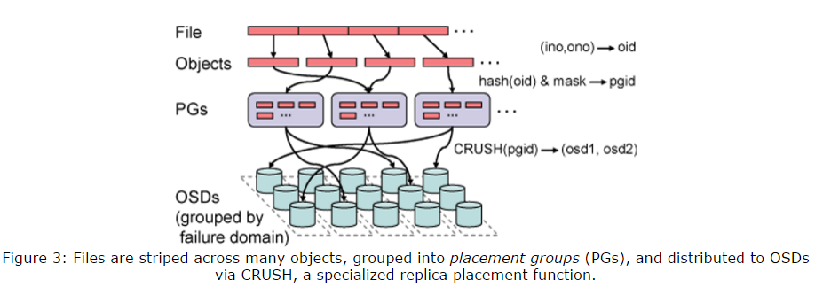
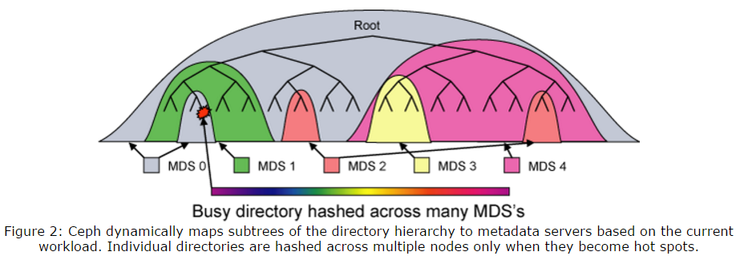
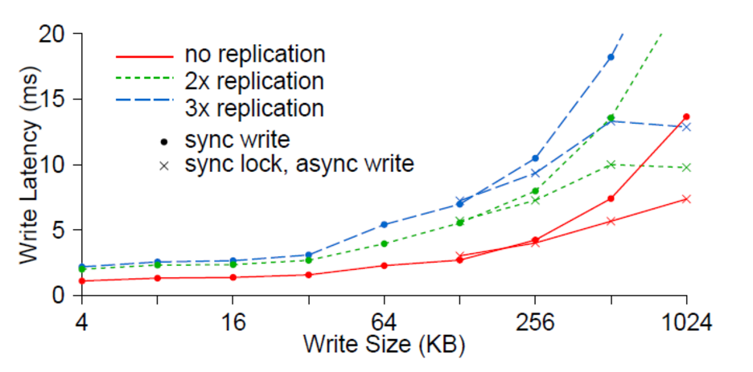
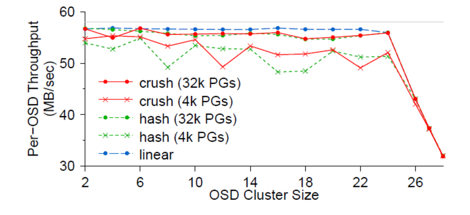
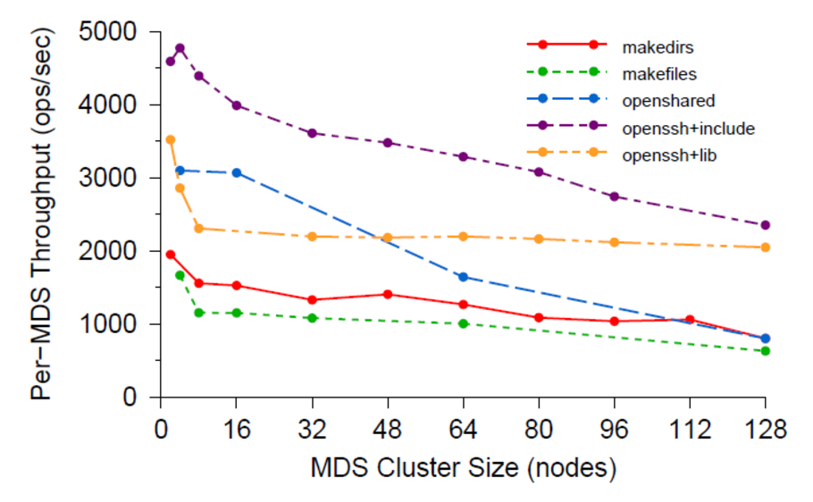

# Storage(Ceph)
> Ceph: A Scalable, High-Performance Distributed File System

## Features 
### 核心设计思想：
- Ceph通过用一个伪随机数据分布函数(CRUSH)替代分布表来最大化的分离数据与元数据管理，
- Ceph利用高度自适应分布式元数据集群,显著提高元数据访问的可扩展性,通过它也提高整个系统的可扩展性。
### 系统设计概览
- 三个主要组件：
  - 客户端：暴露near-POSIX的文件系统接口给主机或进程
  - OSD集群：存储所有数据和元数据
  - 元数据服务器集群：管理名空间(文件名和目录),协调安全与一致性

  
- 三个基本设计：
  - 分离数据和元数据
    - Ceph中完全消除分配列表的设计
    - 文件数据条带化到可计算的命名对象
    - 通过一个**数据分布函数CRUSH**将这些对象分配给存储设备
      - Ceph首先通过简单哈希算法将对象映射到放置组(PGs)，然后通过CRUSH算法将放置组分配到所有OSD。
      - 这个算法是一个伪随机数据分布算法， 能够有效地将每个PG映射到一个用来存储对象副本的有序OSD序列
      - 数据放置不依赖任何的块或对象列表元数据。为了定位每个对象， CRUSH只需要放置组和OSD的cluster map

  
  - 动态分布式元数据管理

    我们的设计通过使用一个双向的存储策略,和通过动态子树分区最大化的本地化和缓存效率进一步减少元数据相关的磁盘I / O。
    - 文件和目录元数据在Ceph中很小,几乎完全由目录入口(文件名)和inode(80字节)组成。
    - Ceph中不需要文件分布元数据，对象名称使用inode号， 并通过CRUSH算法分布到OSD
    - 采用基于**动态子树划分**的新型元数据集群结构
      - 通过使用计数器统计每个MDS中元数据的访问量。
      - 任何操作使得受影响inode及其上层节点直到根目录的计数都增加, 从而提供每个MDS一个权值，来描述最近的载荷分布。
      - 定期比较MDS权值, 通过迁移以保证元数据工作负载均匀分布。

    

    - 它能够适应性智能化地分配职责，可在十个甚至上百个MDS上管理文件系统目录结构。
    - 一个动态的层次分明的分区在每个MDS工作负载中被保留位置，可促进有效更新和预取
    - 元数据服务器的负载分布是基于当前的访问状态，使Ceph能在任何工作负载之下有效的利用当前的MDS资源，获得近似线性扩展性能。
  - 可靠的自动分布的对象存储 RADOS
    - Ceph承担着对存储数据的OSD集群进行数据迁移，备份，故障检测，故障修复的责任
    - OSD可给客户端和元数据服务器提供独立的逻辑对象存储EBOFS，使得Ceph能更加有效的利用计算资源处理能力(CPU和内存)，使每个OSD实现可靠、高可用性的线性扩展性能的对象存储
      - EBOFS设计是一个健壮，灵活并且完全集成B-tree服务，它被用于定位磁盘上对象， 管理块分布和收集索引(PG放置组), 通过开始位置与长度对管理块分配，替代了块列表方式， 使得元数据紧凑
- 客户端操作

    
   
## Pros & Cons
### Pros
- 本质上，Ceph的这些优势均来源于其先进的核心设计思想，有人将其概括为八个字——“无需查表，算算就好”。基于这种设计思想，Ceph充分发挥存储设备自身的计算能力，同时消除了对系统单一中心节点的依赖，从而实现了真正的无中心结构。基于这一设计思想和结构，Ceph一方面实现了高度的可靠性和可扩展性，另一方面保证了客户端访问的相对低延迟和高聚合带宽。
- 在这个核心设计思想的指导下，Ceph 有许多优秀特性，包括统一存储能力、可扩展性、可靠性、性能、自动化的维护等等。
### Cons
1. 代码质量
   - Ceph主要使用C/C++语言编写，同时外围的很多脚本和工具用了Python。相比于更加“现代”的语言，要想写出具备同样可读性、结构良好、调理清晰代码，C++要困难很多。但是，由于存储作为底层系统，对效率的追求是无止境的，因此不太可能舍弃对于内存等底层系统资源的控制，而使用Java/Python这类的语言。
2. 性能
   - 数据双倍写入
   -  IO路经过长
   -  对高性能硬件的支持有待改进。
3. 业务连续性
   - 当集群非常非常大时，Write-All-Read-One对于硬件可靠性的要求几乎是无法满足的。
## Measurement
### 数据性能
1. OSD的吞吐
  - 每个OSD在不同写入块大小和副本数下的吞吐， 工作负载由20个节点上的400个客户端应用组成，性能最后被磁盘读写带宽限制(58MB/s)所限制, 副本数为2或3时， 磁盘I/O会增大到二到三倍，当osd数固定，副本的增加会降低客户端的数据吞吐
  
  -  使用EBOFS和使用其他常用文件系统（ext3，ReiserFS，XFS）的性能对比。尽管小的读写性能会有影响，EBOFS还是能最大使用现有的磁盘带宽， 大于32KB时， 读显著的胜过其他文件系统

  

2. 写延迟

   
   
3. 数据分布和可扩展性 
   - Ceph的数据性能跟随OSD数量几乎线性变化，

### 元数据性能
1. 元数据更新延迟
2. 元数据读延迟

   
3. 元数据扩展 

## Comment
- Ceph 是一个开源系统，免费，初始成本低，但是并不是一个产品，后期运维成本高。
他的设计理念先进，运用了CRUSH算法和元数据动态子树分区；使用统一存储架构(Block/File/Object)，存储特性丰富。但是这也导致Ceph系统复杂系高，部署、优化难度较大，后期成本高。