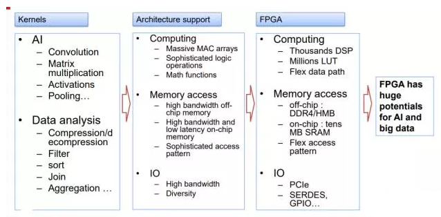

# xPU
***
## Features
随着AI概念火爆全球，做AI芯片的公司也层出不穷。为了让市场和观众能记住自家的产品，各家在芯片命名方面都下了点功夫，既要独特，又要和公司产品契合，还要朗朗上口，也要容易让人记住。比较有意思的是，很多家都采用了“xPU”的命名方式。百度XPU芯片架构突出多样性，着重于计算密集型、基于规则的任务，同时确保效率、性能和灵活性的最大化。XPU的目标是在性能和效率之间实现平衡，并处理多样化的计算任务。FPGA加速器本身很擅长处理某些计算任务，但随着许多小内核交织在一起，多样性程度将会上升。

## Pros&Cons
### Pros
* 基于FPGA，FPGA是高效的，可以专注于特定计算任务。
* 关注计算密集型、基于规则的多样化计算任务，可以通过提高效率和性能，带来类似CPU的灵活性。
* FPGA中XPU的DSP单元提供了并行处理能力，片外DDR4和HBM接口优化了数据传输，而片上SRAM则提供了必要的存储特性。
* 对于没有数据同步的计算任务，XPU的可扩展性与核心数量呈线性关系。

### Cons
* 欠缺的仍是可编程能力，而这也是涉及FPGA时普遍存在的问题。到目前为止，XPU尚未提供编译器。
* 这款处理器在FPGA上实现，通过订制的逻辑电路提供指令。这些小核心类似于CPU，开发者只能使用汇编语言，而所有的执行都由主机来控制。
* 对于数据同步的计算任务，XPU的可扩展性还需进一步优化。

## Key indicators
### Training
* 高计算性能
* 高精度
* 对海量数据处理能力
* 一定的通用性
* 集中在云端
### Inference
* 用户体验
* 逐渐转移到终端

## Comment
AI的许多数据处理涉及矩阵乘法和加法。大量并行工作的GPU提供了一种廉价的方法，但缺点是更高的功率。具有内置DSP模块和本地存储器的FPGA更节能，但它们通常更昂贵。AI芯片该使用什么方法原理去实现，目前仍然众说纷纭，这是新技术的特点，探索阶段百花齐放，这也与深度学习等算法模型的研发并未成熟有关，即AI的基础理论方面仍然存在很大空白。这是指导芯片如何设计的基本前提。因此，目前集中在如何更好的适应已有的数据流式处理模式进行的芯片优化设计。

